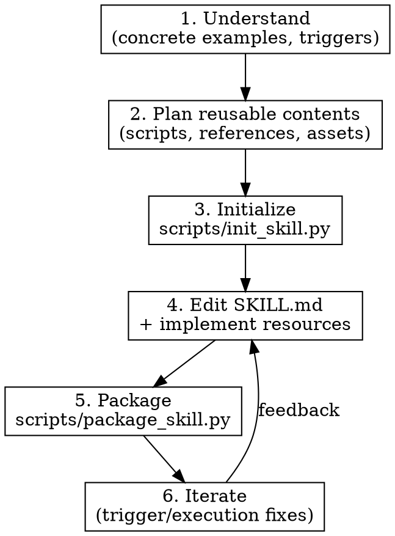

# Skill Creator (Enhanced)

## Overview

Skills are modular, self-contained packages that extend Claude's capabilities with specialized workflows, tool integrations, and domain expertise. This skill guides you through creating effective skills based on Anthropic's official guide.

**Core principle:** The context window is a public good. Only add context Claude doesn't already have.

## When to Use

- Creating a new skill from scratch
- Updating or debugging an existing skill
- Skill doesn't trigger, triggers too often, or instructions aren't followed
- Packaging and distributing a skill

## Skill Structure (필수 3-Piece 패턴)

**스킬 생성 시 반드시 이 구조를 따른다. SKILL.md 하나에 모든 것을 넣지 않는다.**

```
.claude/skills/{skill-name}/
├── SKILL.md              # 워크플로우만 (간결, ~150줄 이내)
└── references/           # 상세 체크리스트, 템플릿, 예시 (온디맨드 로드)
    └── {topic}.md

.claude/commands/
└── {command-name}.md     # 사용자가 /로 호출하는 진입점 (스킬이 user-invocable이면 필수)
```

### 분리 기준

| 어디에? | 무엇을? |
|---------|---------|
| `SKILL.md` | 워크플로우 Step, 간결한 판단 기준, 관련 스킬 참조 |
| `references/` | 상세 체크리스트 (10+항목), 코드 템플릿, BAD/GOOD 예시, 판단 공식 |
| `commands/` | `/`로 호출하는 진입점. 스킬 이름 + Usage만 |

### references 분리 신호 (하나라도 해당하면 분리)
- 체크리스트 10개 이상 / 코드 블록 3개 이상 / 테이블 10행 이상
- 특정 Step에서만 필요한 상세 정보 / BAD/GOOD 비교 예시

## YAML Frontmatter Rules

```yaml
---
name: kebab-case-only       # No spaces, capitals, "claude", or "anthropic"
description: What + When + Triggers. Under 1024 chars. No < > tags.
---
```

**Good description:** `Manages Linear workflows including sprint planning. Use when user mentions "sprint", "Linear tasks", or "create tickets".`

**Bad description:** `Helps with projects.`

## Creation Process



### Step 1: Understand with Examples

Ask the user:
- What functionality should this skill support?
- Give examples of how this skill would be used?
- What would a user say to trigger this skill?

### Step 2: Plan 3-Piece Structure

**반드시 3개 파일 계획을 먼저 세운다:**

1. **SKILL.md 목차** — Step 몇 개, 각 Step 한 줄 요약
2. **references/ 필요 여부** — 상세 체크리스트/템플릿이 있으면 분리 대상 식별
3. **command 필요 여부** — 사용자가 `/`로 직접 호출하면 command 생성

### Step 3: Create Files

**생성 순서**: references → SKILL.md → commands

- SKILL.md: 150줄 이내, 상세는 `references/{topic}.md 참조`로 위임
- command: 스킬 이름 + Usage + allowed-tools만

Degrees of freedom:
- **High**: Multiple approaches valid, heuristics guide
- **Medium**: Preferred pattern exists, some variation OK
- **Low**: Fragile operations, specific sequence required

Consult reference guides as needed:
| Need | Reference |
|------|-----------|
| Multi-step processes | `references/workflows.md` |
| Output quality | `references/output-patterns.md` |
| Advanced patterns | `references/advanced-patterns.md` |
| Troubleshooting | `references/troubleshooting.md` |

### Step 4: Validate

- [ ] `SKILL.md` 150줄 이내
- [ ] 상세 체크리스트/템플릿 → `references/`로 분리됨
- [ ] user-invocable이면 `commands/` 파일 존재
- [ ] YAML frontmatter에 트리거 키워드 포함
- [ ] 관련 스킬 참조 테이블 + 완료 체크리스트 있음

### Step 5: Iterate

| Problem | Fix |
|---------|-----|
| Undertriggering | Add more keywords to description |
| Overtriggering | Be more specific, add negative triggers |
| Execution issues | Improve instructions, add error handling |

## Skill Categories

| Category | Purpose | Key Techniques |
|----------|---------|----------------|
| Document/Asset Creation | Consistent, high-quality output | Style guides, templates, quality checklists |
| Workflow Automation | Multi-step consistent processes | Validation gates, iterative refinement |
| MCP Enhancement | Guided MCP tool workflows | Sequence coordination, domain expertise |

## Common Mistakes

- **SKILL.md에 모든 것을 넣음** → references로 분리 (가장 흔한 실수)
- **command 파일 누락** → 사용자가 `/`로 호출 불가
- Description too vague or missing trigger phrases
- Overloading SKILL.md with content that belongs in references/
- Using spaces or capitals in skill name
- Exceeding 1024 chars in description or using `< >` tags
- Including unnecessary docs (README, CHANGELOG) — skills only need what Claude needs
